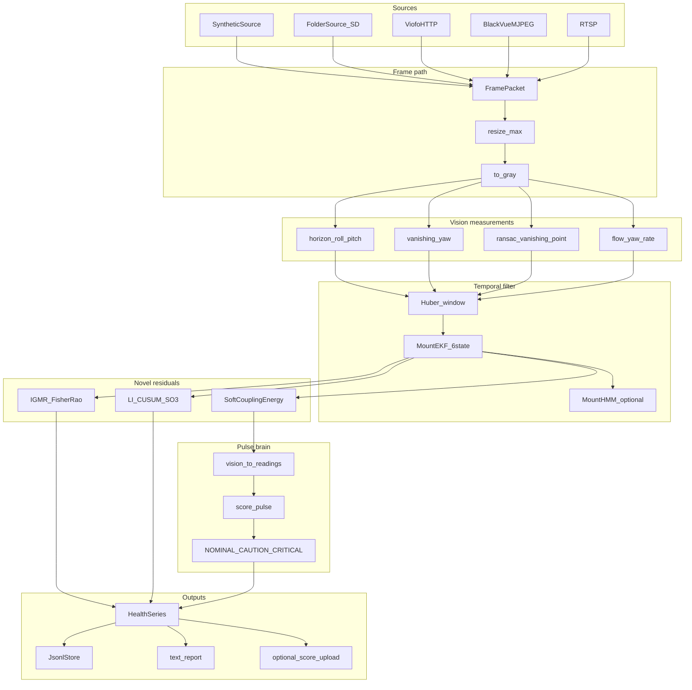
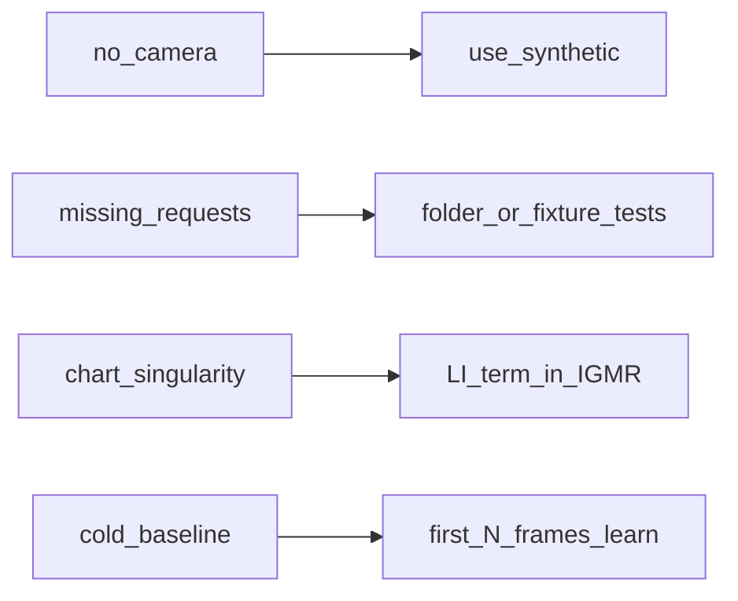

# Pipeline schematic

Generated technical view of the **nadir-core 0.2** dashcam → Pulse path.

## End-to-end

## Module map

| Stage | Primary modules |
|-------|-----------------|
| Ingest | `dashcam/sources/*`, `dashcam/ingest/*` |
| Vision | `dashcam/vision/*`, `dashcam/features/*` |
| Geometry | `dashcam/geometry/lie_so3.py`, `homography.py` |
| Filters | `dashcam/filters/ekf_mount.py`, `robust_stats.py` |
| Novel math | `dashcam/math_novel/*` + `docs/proofs/*` |
| Score | `dashcam/bridge.py` → `scoring/pulse.py` |
| Agent CLI | `dashcam/agent.py`, `dashcam/cli.py` |

## Data contracts

- **In:** BGR/`uint8` frames or synthetic arrays; optional NMEA speed.
- **Mid:** `MountEstimate` (yaw/pitch/roll deg, confidence, notes).
- **Out:** `HealthSample` JSONL; Pulse `DriftTier`; optional upload JSON with `claim_boundary=vision_mount_health_only`.

## Failure modes (by design)

